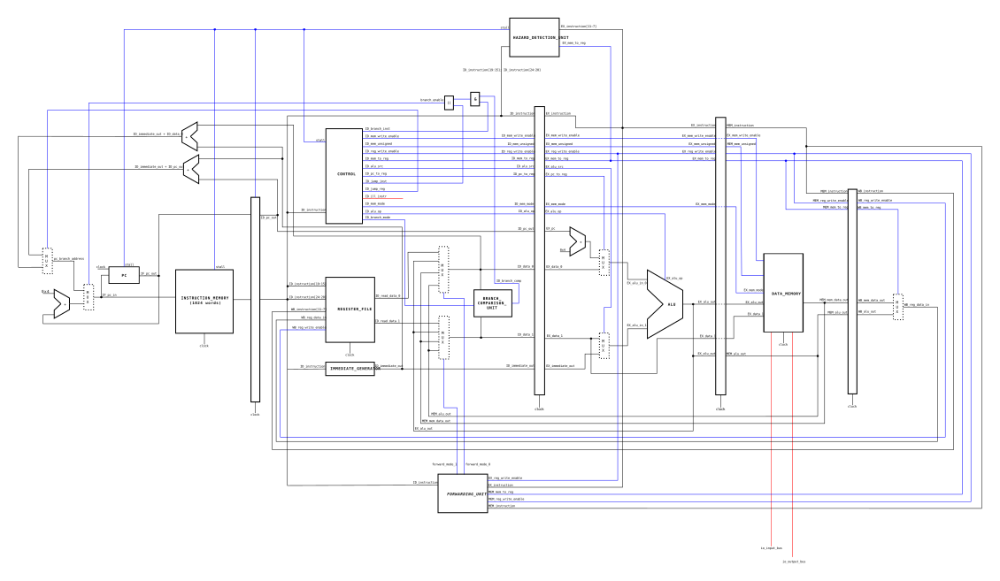
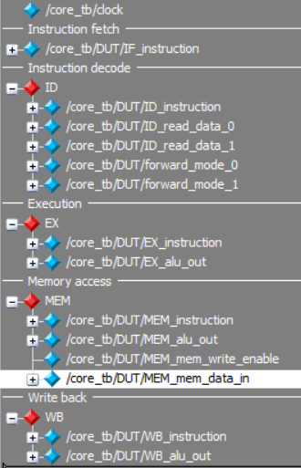

# RV32I core

*Lowie Deferme & Jonathan Butaye*

## Schematic



## Structure

Bovenstaand schema toont de gepipelinede RISC-V processor die wij ontworpen hebben op basis van het boek 'Computer Organization and Design' van David A. Patterson en John L. Hennessy. Deze processor bestaat uit volgende 5 fases die hieronder beschreven zijn. 

### Instruction fetch (IF)

### Instruction decode (ID)

### Execution (EX)

In deze fase worden de bewerkingen van de processor uitgevoerd. Deze gebeuren in de ALU (Aritmetic Logic Unit). Deze heeft drie ingangen en een uitgang. 
Het controlesignaal dat toekomt zal bepalen welke berekening/instructie er zal uitgevoerd worden op de twee data ingangen. Het resultaat wordt dan vrijgegeven aan de uitgang.
Voor beide data ingangen van de ALU staat nog een multiplexer om te bepalen welke data er binnenkomt aan de ALU. Aan de ene ingang wordt er een keuze gemaakt tussen de volgende PC waarde en data die afkomstig is van de ID fase. Aan de andere ingang is het een keuze tussen data uit de ID fase en een getal van de immediate_generator. Deze twee multiplexers worden aangestuurd door de controle unit.

### Memory access (MEM)

### Write back (WB)

## Testbenches

Om de core te kunnen testen is er gebruik gemaakt van twee verschillende test benches, één voor de alu en één voor de volledige core.

### ALU testbench

Voor de definitie van de testbench module is eerst de `timescale` gezet en wordt er een macro gedefinieerd. Deze macro dient om op een gemakkelijke manier na te gaan of twee signalen gelijk zijn. 

```verilog
`timescale 1ns/10ps

`define assert(signal, value) \
        if (signal !== value) begin \
            $display("TEST FAILED: %h != %h", signal, value); \
            $stop; \
        end
```

Hierna wordt de module gedefinieerd samen met de DUT (Device Under Test). De interne signalen van de testbench module zijn de input en output signalen van de DUT. Tot slot worden hier ook de nodige "headers" toegevoegd.
* `alu_codes.h` bevat een codering voor alle modi van de alu. Op deze manier kan de operation in de Verilog code op `ALU_SUB` worden gezet i.p.v. `4'b0001`, dat verbeterd de leesbaarheid.
* De belangrijkste parameter uit `riscv.h` is XLEN. Die geeft aan uit hoeveel bits de databus bestaat.

```verilog
module alu_tb;

// Include necessary headers
`include "../src/alu_codes.h"  // Contains alu operation codes
`include "../src/riscv.h"      // Contains XLEN definition

// IO
reg [XLEN-1:0] in_0, in_1;
reg [3:0] operation;
wire [XLEN-1:0] out;

// Device under test
alu DUT (
    .in_0(in_0),
    .in_1(in_1),
    .operation(operation),
    .out(out)
);
```

Tot slot zitten er in de testbench natuurlijk de testen zelf nog. Deze testen staan in een `initial` blok. Hieronder wordt een voorbeeld gegeven van één test, andere testen zijn gelijkaardig opgebouwd.

```verilog
$display("START TEST: add");
operation <= ALU_ADD;
in_0 <= 5;
in_1 <= 7;
#1 `assert(out, 12)
in_0 <= -2;
in_1 <= 7;
#1 `assert(out, 5)
$display("TEST DONE: add");
```

In deze test is ook meteen de gebruiktwijze van de macro die hierboven vermeld werd duidelijk.

### Core testbench

De testbench voor de `core` heeft ongeveer dezelfde setup als die van de `ALU`. Met het verschil dat er in deze testbench geen testen gedefineerd zijn. Het enige dat deze testbench doet is de core in een bekende staat brengen met een reset. Daarna begint de core het programma uit te voeren dat in het instructie memory staat. Om de werking van dergelijk programma na te gaan is steeds de waveform editor gebruikt. De signalen die vaak nuttig bleken zijn te zien in onderstaande indeling.



