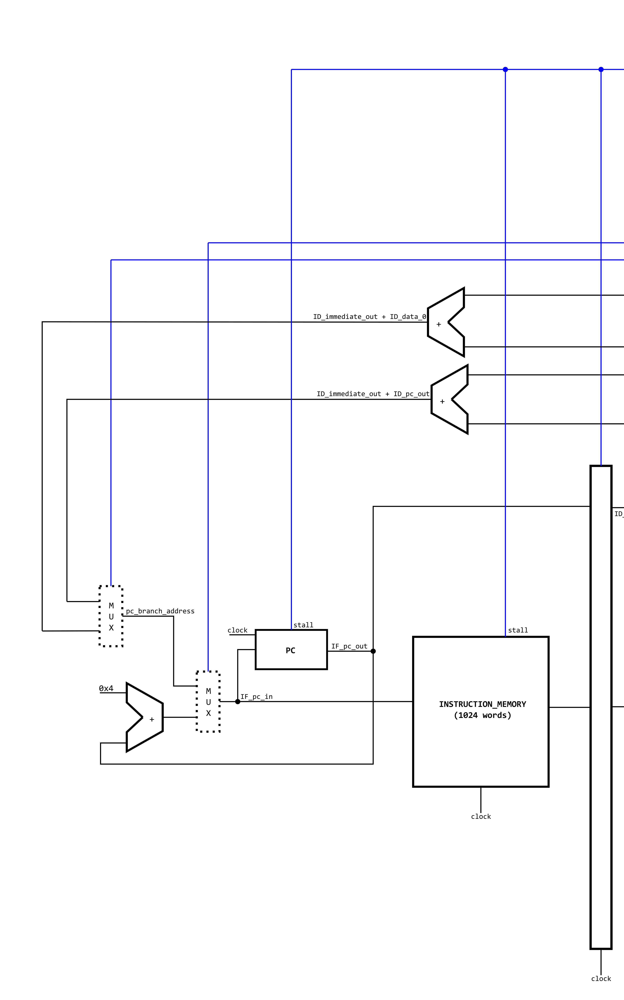
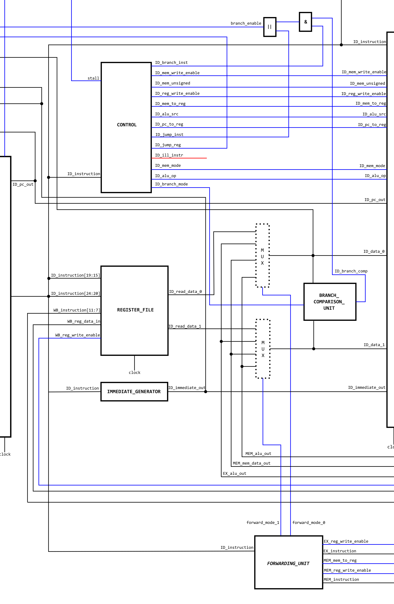
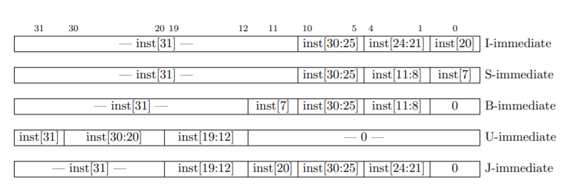
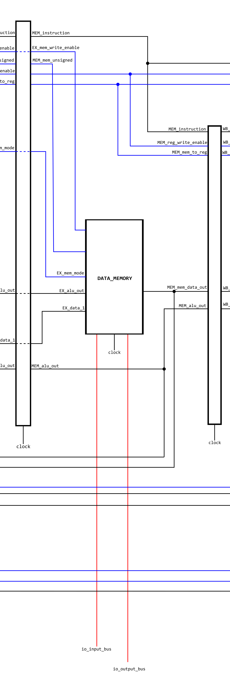

# RV32I core

*Lowie Deferme & Jonathan Butaye*

## Schematic


## Structure

Bovenstaand schema toont de *pipelined* RISC-V processor die wij ontworpen hebben op basis van het boek 'Computer Organization and Design' van David A. Patterson en John L. Hennessy. Deze processor bestaat uit 5 fases die hieronder beschreven zijn. 

### Instruction fetch (IF)

In deze fase wordt er aan de hand van de program counter (PC) een instructie opgehaald uit het instructiegeheugen. Dit gebeurt bij elke stijgende flank van het kloksignaal. De waarde die hiervoor aangelegd wordt als adres voor het instructie geheugen wordt bepaald door een multiplexer. Bij normale werking zal de PC bij elke klokcyclus met 4 stijgen. Indien er echter een branch of een jump genomen wordt zal de multiplexer dit branch adres doorgeven aan het instructiegeheugen. Het controlesignaal bestaat uit het comparison signaal van de *branch comparison unit* samen met `branch_inst` of `jump_inst`.



### Instruction decode (ID)

In deze fase wordt de instructie omgezet naar controle signalen om op die manier de rest van de core correct aan te sturen.



#### Control
De belangrijkste module uit de instruction decode fase is de `CONTROL` module. `CONTROL` neemt de volledige instructie en "decodeert" deze om vervolgens controle signalen te genereren die de *dataflow* beïnvloeden. De module heeft naast instructie ook nog een `stall` input, die zorgt er simpelweg voor dat alle outputs `'b0` worden waneer de core *must stall*. Hieronder staan kort de io's van deze module uitgelegd.

```verilog
module control (
    instruction,        // input -> full instruction
    stall,              // input -> high if processor must stall
    branch_enable,      // output -> high for branch instructions
    branch_mode,        // output -> branch comparison mode (definitions in comparison_codes.h))
    mem_write_enable,   // output -> high enables write to data memory
    mem_unsigned,       // output -> high when unsigned load
    mem_mode,           // output -> specifies memory mode i.e. byte/halfword/word
    reg_write_enable,   // output -> high enables write to registerfile
    mem_to_reg,         // output -> high routes data memory output to register input
    alu_op,             // output -> ALU operating mode (definitions in alu_codes.h)
    alu_src,            // output -> high: alu input = immediate, low: alu input = register file
    pc_to_reg,          // output -> high: writes pc + 4 to destination reg
    jump_enable,        // output -> high for jump instructions
    jump_reg,           // output -> high: set pc to reg content
    ill_instr           // output -> high if instruction is not recognized
);
```

#### Register file

De `REGISTER_FILE` bestaat bij een RV32I uit 32 registers en heeft twee *address* inputs zodat er twee waarden gelijktijdig uitgelezen kunnen worden. Verder heeft de register file een *address* en een *data* ingang om nieuwe dat weg te schijven. Dit gebeurt enkel wanneer de `write_enable` ingang hoog is.

```verilog
module register_file (
    read_reg_0,     // input -> address of reg to read
    read_reg_1,     // input -> address of reg to read
    write_reg,      // input -> address of reg to write
    write_data,     // input -> data to write
    write_enable,   // input -> high enables write
    read_data_0,    // output -> data at address "read_reg_0"
    read_data_1,    // output -> data at address "read_reg_1"
    clock,          // input -> clock
    reset           // input -> resets all registers
);
```

#### Immediate generator 

De taak van de `IMMEDIATE_GENERATOR` is het genereren van getallen op basis van de instructie, onderstaande figuur geeft de manier weer waarop deze getallen zijn opgebouwd voor de verschillende types van instructies.



*Source: https://riscv.org/wp-content/uploads/2017/05/riscv-spec-v2.2.pdf Figure 2.4*

#### Branch comparison unit

Door de `BRANCH_COMPARISON_UNIT` in de instruction decode fase te steken, moet de processor slechts één klokcyclus wachten in plaats van twee wanneer een branch genomen wordt. Deze module vergelijkt `ID_data_0` & `ID_data_1` op basis van een *comparison mode*. Deze modi zijn gedefinieerd in `"comparison_codes.h"`. Wanneer de data inputs aan de voorwaarde van de gespecificeerde modus voldoen wordt `ID_branch_comp` hoog.

Hieronder staan nog even de io's van deze module vermeld:

```verilog
module branch_comparison_unit (
    in_0,    // input -> first register file output
    in_1,    // input -> second register file output
    mode,   // input -> comparison mode
    branch  // output -> high if comparison is true
);
```

#### Forwarding unit

Deze module zit niet volledig in de `ID` fase maar stuurt er wel een groot deel logica aan waardoor ze hier besproken word. De `FORWARDING_UNIT` zal controleren of het resultaat van een nog niet volledig afgewerkte instructie al nodig is een een volgende instructie. Indien mogelijk zal de *forwarding unit* er dan voor zorgen dat het resultaat tegen de normale *data flow* in *gefoward* wordt door *mux* in het midden van tekening aan te sturen.

### Execution (EX)

In deze fase worden de bewerkingen van de processor uitgevoerd. Deze gebeuren in de ALU (Aritmetic Logic Unit). Deze heeft drie ingangen en een uitgang. 
Het controlesignaal dat toekomt zal bepalen welke berekening/instructie er zal uitgevoerd worden op de twee data ingangen. Het resultaat wordt dan vrijgegeven aan de uitgang.
Voor beide data ingangen van de ALU staat nog een multiplexer om te bepalen welke data er binnenkomt aan de ALU. Aan de ene ingang wordt er een keuze gemaakt tussen de volgende PC waarde en data die afkomstig is van de ID fase. Aan de andere ingang is het een keuze tussen data uit de ID fase en een getal van de immediate_generator. Deze twee multiplexers worden aangestuurd door de controle unit.


### Memory access (MEM)

In deze fase wordt er data geschreven of gelezen in het datageheugen of de memory mapped inputs/outputs (IO's). Aangezien het ram geheugen dat gebruikt wordt in het data geheugen al registers bevat worden de signalen rechtstreeks vanuit de EX fase aangesloten. Voor de IO's worden er dan interne registers toegevoegd in de data memory module. De ingangen aan deze module bevatten data en signalen zoals het adres voor het geheugen, data die weggeschreven dient te worden en een aantal controlesignalen. 



### Write back (WB)

Tijdens de WB fase wordt de data, die opgehaald werd uit het datageheugen of werd berekend door de ALU, naar de registerfile geschreven. Een multiplexer die wederom aangestuurd wordt door een controlesignaal verstuurd door de controle unit zal de juiste data doorgeven. Het adres van het register waarin deze data geschreven moet worden wordt bepaalt uit de instructie die toekomt in de WB fase. 

## Testbenches

Om de core te kunnen testen is er gebruik gemaakt van twee verschillende test benches, één voor de alu en één voor de volledige core.

### ALU testbench

Voor de definitie van de testbench module is eerst de `timescale` gezet en wordt er een macro gedefinieerd. Deze macro dient om op een gemakkelijke manier na te gaan of twee signalen gelijk zijn. 

```verilog
`timescale 1ns/10ps

`define assert(signal, value) \
        if (signal !== value) begin \
            $display("TEST FAILED: %h != %h", signal, value); \
            $stop; \
        end
```

Hierna wordt de module gedefinieerd samen met de DUT (Device Under Test). De interne signalen van de testbench module zijn de input en output signalen van de DUT. Tot slot worden hier ook de nodige "headers" toegevoegd.
* `alu_codes.h` bevat een codering voor alle modi van de alu. Op deze manier kan de operation in de Verilog code op `ALU_SUB` worden gezet i.p.v. `4'b0001`, dat verbeterd de leesbaarheid.
* De belangrijkste parameter uit `riscv.h` is XLEN. Die geeft aan uit hoeveel bits de databus bestaat.

```verilog
module alu_tb;

// Include necessary headers
`include "../src/alu_codes.h"  // Contains alu operation codes
`include "../src/riscv.h"      // Contains XLEN definition

// IO
reg [XLEN-1:0] in_0, in_1;
reg [3:0] operation;
wire [XLEN-1:0] out;

// Device under test
alu DUT (
    .in_0(in_0),
    .in_1(in_1),
    .operation(operation),
    .out(out)
);
```

Tot slot zitten er in de testbench natuurlijk de testen zelf nog. Deze testen staan in een `initial` blok. Hieronder wordt een voorbeeld gegeven van één test, andere testen zijn gelijkaardig opgebouwd.

```verilog
$display("START TEST: add");
operation <= ALU_ADD;
in_0 <= 5;
in_1 <= 7;
#1 `assert(out, 12)
in_0 <= -2;
in_1 <= 7;
#1 `assert(out, 5)
$display("TEST DONE: add");
```

In deze test is ook meteen de gebruiktwijze van de macro die hierboven vermeld werd duidelijk.

### Core testbench

De testbench voor de `core` heeft ongeveer dezelfde setup als die van de `ALU`. Met het verschil dat er in deze testbench geen testen gedefineerd zijn. Het enige dat deze testbench doet is de core in een bekende staat brengen met een reset. Daarna begint de core het programma uit te voeren dat in het instructie memory staat. Om de werking van dergelijk programma na te gaan is steeds de waveform editor gebruikt. De signalen die vaak nuttig bleken zijn te zien in onderstaande indeling.


